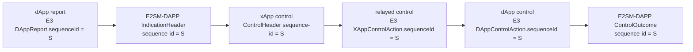
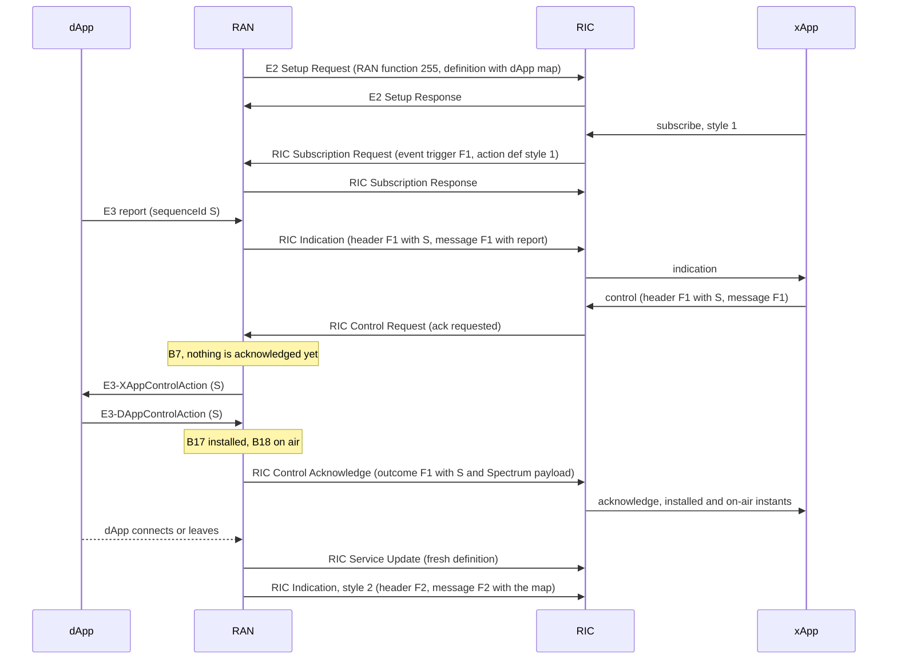

# E2SM-DAPP: procedure flow

How an xApp learns which dApps exist, subscribes, receives reports, sends a
control, and gets the acknowledge, with every E2SM-DAPP message placed on the E2AP
message that carries it and on the code that handles it.

This is section 3 of the specification. The index is [README.md](README.md). The
field lists are in [02-ie-mapping.md](02-ie-mapping.md). The E2-E3 loop and its box
numbers (`A1`..`A20`, `B1`..`B19`) are defined in
[../path-a-e3-loop.md](../path-a-e3-loop.md) and
[../path-b-e2-e3-loop.md](../path-b-e2-e3-loop.md).

## 1. The cast

| Role | In this repository's world | Speaks |
|---|---|---|
| **dApp** | an application next to the RAN, for example the Spectrum dApp | E3AP to the RAN, through libe3 |
| **RAN** | a gNB (OAI today, OCUDU in progress). It hosts the E3 agent, the E2 agent, and the **E2-E3 bridge** (the "dApp RAN function") between them | E3AP to dApps, E2AP to the RIC |
| **RIC** | the near-RT RIC | E2AP to the RAN, RMR to xApps |
| **xApp** | an application on the RIC, for example the Spectranet decision engine | E2SM-DAPP, wrapped in E2AP by the RIC |

The RAN function id of E2SM-DAPP in E2 is **255**. All E2SM-DAPP traffic is
RIC Subscription, RIC Indication, RIC Control and the RAN function advertisement.
There is no dApp-to-RIC path that bypasses the RAN.

## 2. Every message on the flow

| # | Direction | E2AP message | E2SM-DAPP content | Where it is described |
|---|---|---|---|---|
| S1 | RAN to RIC | E2 Setup Request | RAN function item for id 255: definition, revision 1, OID | 3 |
| S2 | RIC to RAN | E2 Setup Response | none (E2AP only) | |
| S3 | RAN to RIC | RIC Service Update | RAN function id 255 in "modified", with a fresh definition | 3 |
| S4 | RIC to RAN | RIC Service Acknowledge | none (E2AP only) | |
| P1 | RIC to RAN | RIC Subscription Request | event trigger (format 1), one report action with an action definition (style 1 or 2) | 4 |
| P2 | RAN to RIC | RIC Subscription Response | none (E2AP only), the single action is admitted | 4 |
| P3 | RIC to RAN | RIC Subscription Delete Request | none | 4 |
| P4 | RAN to RIC | RIC Subscription Delete Response | none | 4 |
| R1 | RAN to RIC | RIC Indication (report) | style 1: indication header format 1 and message format 1 (one dApp report) | 5 |
| R2 | RAN to RIC | RIC Indication (report) | style 2: indication header format 2 and message format 2 (the dApp subscription map) | 3, 5 |
| C1 | RIC to RAN | RIC Control Request | control header format 1, control message format 1, with "ack" requested | 6 |
| C2 | RAN to RIC | RIC Control Acknowledge | control outcome format 1 (timestamp, sequence id, optional Service-Model payload). **Sent late, see 6.3.** | 6 |

The RAN never sends a RIC Control Failure for E2SM-DAPP: `e2_send_control_failure`
exists in `flexric/src/agent/e2_agent.c:847` but nothing calls it. Every control, even
one that was refused or that timed out, ends in a RIC Control Acknowledge.

E2SM-DAPP uses no other E2AP procedure. In particular it has no RIC Query, no
insert and no policy ([02-ie-mapping.md](02-ie-mapping.md#21-why-insert-policy-and-query-are-not-used)).

## 3. Discovery: how an xApp learns the dApp ids

An xApp needs a `dapp-id` and an E3 RAN function id for the control header. Both
come from the **dApp E3 subscription map**: the list of dApps connected to the RAN,
each with the E3 RAN functions it has subscribed to. The map reaches the xApp in
three ways.

### 3.1 In the RAN function definition (E2 Setup and RIC Service Update)

The map is the optional `dappE3Subscriptions` field of the report item (style 1) and
of the control item (style 1) in the RAN function definition
([02-ie-mapping.md](02-ie-mapping.md#5-ran-function-definition)).

| Step | E2AP message | What happens | Code |
|---|---|---|---|
| RAN builds the definition | (inside S1 or S3) | The agent asks the RAN for the definition through `read_setup`, replaces the name, OID and description with its constants, and encodes it | `flexric/src/sm/dapp_sm/dapp_sm_agent.c`, `on_e2_setup_dapp_sm_ag` (lines 244-275; the RAN callback is called at 254-255, the name replaced at 258-259, the encode at 266) |
| RAN fills styles and map | | OAI: two report styles, one control style, no event trigger, the map copied into report style 1 and control style 1 | `oai/openair2/E2AP/RAN_FUNCTION/O-RAN/ran_func_dapp.c`: `fill_dapp_ran_def` (183-208), `build_dapp_e3_subs_from_map` (131-171), `read_dapp_setup_sm` (218-228) |
| E2 Setup | S1 | The definition goes in the RAN function item | `flexric/src/agent/gen_msg_agent.c:51-60` (E2AP v1), `92-99` (v2, v3) |
| RIC stores it | | flexric RIC: `ric_on_e2_setup_dapp_sm_ric` (`dapp_sm_ric.c:242-253`) decodes it. With xDevSM the xApp reads the definition from the E2 node information the RIC exposes (`json_ran_info["gnb"]["ranFunctions"]`) and decodes it itself | |
| xApp decodes it | | xDevSM: `get_ran_function_description` finds the RAN function with id 255 in the RIC's node information and calls `dapp_dec_func_def_asn` | `xdevsm/src/xdevsm/decorators/report.py:132-155`, `decorators/control.py:82-114`, `sm_framework/py_oran/dapp/report/DAppFunctionDef.py:147-151` |

**The definition is rebuilt on every E2 Setup Request** (the OAI comment at
`ran_func_dapp.c:331-336` says so: the agent regenerates the definition, including
the current map, on every E2 SETUP REQUEST retry).

If no dApp has any subscribed function, OAI omits `dappE3Subscriptions` altogether
instead of sending an empty list (`ran_func_dapp.c:142-145,195-205`). This matters
because flexric's encoder cannot encode an empty list in the definition (see
[06-discrepancies.md](06-discrepancies.md)). An xApp must treat an absent field and an
empty list the same way: no dApp is connected.

### 3.2 When the set of dApps changes: RIC Service Update and format 2 indications

When a dApp connects or disconnects, OAI does two things on the E3 agent's thread
(`oai/openair2/E3AP/e3_agent.c:80-98`, `on_dapp_status_changed`, which calls
`notify_dapp_status_changed`, `ran_func_dapp.c:329-342`):

1. **RIC Service Update (S3).** It calls `trigger_ric_service_update_api()`
   (`flexric/src/agent/e2_agent_api.c:168-208`), which rebuilds the definition and
   sends it as RAN function 255 under "modified" (no function is added or deleted).
   It is skipped until the RIC has been heard from: `e2_ric_seen` is set by the first
   subscription or control (`ran_func_dapp.c:337-340`, `456`, `501`). The comment
   at `ran_func_dapp.c:331-336` gives the reason: the send is synchronous on the E3
   thread and blocks while the SCTP association is still being set up.
2. **Format 2 indication (R2).** For every style-2 subscription it sends a RIC
   Indication with header format 2 and message format 2 holding the **current**
   map (`generate_e2_indication_dapp_e3_subscriptions`, `ran_func_dapp.c:237-323`).
   The list is built with every dApp that has at least one function
   (`ran_func_dapp.c:250-255`), so it can be **empty**: all dApps left.

The RIC Service Update revision starts at `1` and increases by one per update
(`e2_agent_api.c:175,198`). The E2 Setup Request announced revision `1`
(`dapp_sm_id.h:8`), so the first update repeats it. See
[01-identity-and-registration.md](01-identity-and-registration.md).

### 3.3 In every report header

Each style-1 indication names the `dapp-id` that sent the report (indication header
format 1). An xApp that only wants to answer reports does not need the map at all:
it echoes the `dapp-id` and `ran-function-id` of the header it just received. The
Spectranet decision engine does exactly this. The ingestor stores `dapp_id` with
each report (`spectranet-xapps/data_ingestor_xapp/data_ingestor_xapp.py:794,1223-1224`),
and the decision engine reads it back with the detection and puts it in the control
(`spectranet-xapps/decision_engine_xapp/decision_engine_xapp.py:836-887`).

### 3.4 What discovery does not do

* **Subscribing to style 2 does not return the current map.** `write_subs_dapp_sm`
  (`ran_func_dapp.c:453-487`) only records the RIC request id. The first format 2
  indication arrives at the next dApp connect or disconnect. To learn the current
  map, read it from the definition (3.1) or subscribe before the dApps start.
* **There is no initial indication of any kind** for style 1. Reports flow when
  dApps send them.
* **Cached definitions go stale.** The decision engine caches the decoded
  definition once per gNB (`decision_engine_xapp.py:868-880`). A RIC Service Update
  after that does not change what it holds. It does not matter for its operation,
  which takes the `dapp-id` from the reports.

## 4. Subscription: pairing the xApp with the report stream

E2SM-DAPP has no per-dApp subscription. A subscription picks a **report style**
and receives that style's indications from **every** dApp.

| Step | E2AP message | E2SM-DAPP content | Code |
|---|---|---|---|
| xApp builds the request | P1 | event trigger: format 1 (empty). One action: type `report`, id 1, action definition `style = 1` or `2`. | flexric: `on_subscription_dapp_sm_ric` (`dapp_sm_ric.c:49-70`). xDevSM: `DAppReport.subscribe` (`dapp_report.py:122-165`), which builds `DAppActionDefWrapper.create_action_def_from_report_style` and sends through the RIC's subscription manager with `action_type="report"` and a "continue" subsequent action |
| RAN decodes it | | event trigger, action definition | `on_subscription_dapp_sm_ag` (`dapp_sm_agent.c:45-81`) |
| RAN registers the subscriber | | style 1 adds the RIC request id to the format-1 subscriber list, style 2 to the format-2 list | `write_subs_dapp_sm` (`ran_func_dapp.c:453-487`): `ric_subs_frmt1_add` or `ric_subs_frmt2_add` |
| Admission | P2 | the single action is always admitted | `msg_handler_agent.c:338-344`, `generate_subscription_response` (line 254) |
| Teardown | P3, P4 | | `e2ap_handle_subscription_delete_request_agent` (`msg_handler_agent.c:346-368`), `free_aperiodic_subscription` (`ran_func_dapp.c:439-442`) |

The E2 agent insists on exactly **one** action per request and that it is a report
(`msg_handler_agent.c:229-235`), and it treats a second request under the same RIC
request id as a replacement of the first (`msg_handler_agent.c:283-296`). The
subscription is **aperiodic** (`dapp_sm_agent.c:75`): there is no reporting period.

**Pairing with a dApp is done at control time, not at subscription time.** The xApp
chooses a `(dapp-id, ran-function-id)` pair from what it learned in section 3 and
puts it in the control header. The RAN does not check that the dApp exists or has
subscribed to that function before relaying; `e3_send_xapp_control`
(`oai/openair2/E3AP/e3_agent.c:288-310`) reports only whether libe3 accepted the
call.

## 5. Indication delivery (report up)

This is the report-up leg of [Path B](../path-b-e2-e3-loop.md#report-up-leg-legreport_up),
boxes `B1` to `B4`, entered from `A20`.

| Box | What happens | E2AP / E2SM-DAPP | Code |
|---|---|---|---|
| `A20` | The E3 report arrives from the dApp and is handed to the bridge | E3AP `E3-DAppReport` with `dAppIdentifier`, `ranFunctionIdentifier`, `sequenceId`, `reportData` | `oai/openair2/E3AP/e3_agent.c:33-54`, `e2_e3_bridge` |
| `B1` build | The bridge makes one indication per **style-1** subscriber, header format 1 (`ran-function-id`, `dapp-id`, node identity, `timestamp`, `sequence-id`) and message format 1 (`data` = the unchanged `reportData`) | R1: RIC Indication, type report, `RIC Indication Header` and `RIC Indication Message` | `ran_func_dapp.c:355-431`, `generate_e2_indication_from_e3_dapp_report`; every subscriber gets every report, with no filter on dApp or function (loop at 387-426) |
| `B1` encode | The agent encodes header and message. A header or message the encoder declines is **dropped**, not aborted | | `on_indication_dapp_sm_ag` (`dapp_sm_agent.c:102-140`, lines 123-131) |
| `B1` send | RIC Indication, action id from the subscription, no sequence number, no call process ID | | `generate_aindication`, `flexric/src/agent/e2_agent.c:42-65` |
| `B2` | E2AP decode at the RIC | | the RIC |
| `B3` decode | Header and message decoded. For format 1 the inner payload is decoded too, using `ran-function-id` as the key | | flexric: `on_indication_dapp_sm_ric` (`dapp_sm_ric.c:96-146`, inner decode at 128). xDevSM: `DAppReport.decode_message` (`dapp_report.py:64-119`) decodes the header and the message and hands both to the xApp callback. The inner decode is left to the xApp: `DAppE3IndPayloadWrapper` (`dapp/e3/DAppE3IndPayload.py`) |
| `B4` | The xApp processes the report | | `spectranet-xapps/data_ingestor_xapp/data_ingestor_xapp.py:709-813` stores it; the decision engine reads it later |

Style 2 follows the same path with R2 and a different trigger (section 3.2). It has
no `A20`: the RAN generates it itself from the E3 subscription map.

Two behaviors of flexric's RIC-side decode to know about
([06-discrepancies.md](06-discrepancies.md)): a format 1 message whose inner payload
cannot be decoded (for example an unknown `ran-function-id`) fails an `assert`
(`dapp_sm_ric.c:130`), and an unknown format fails another (`dapp_sm_ric.c:140`).

## 6. Control relay and the deferred acknowledge (policy down and mitigation)

This covers boxes `B5` to `B19`.

### 6.1 Policy down: from the xApp to the dApp

| Box | What happens | E2AP / E2SM-DAPP | Code |
|---|---|---|---|
| `B4` to `B5` | The xApp decides, builds the control header (`ran-function-id`, `dapp-id`, `timestamp`, `sequence-id` **echoed from the report**) and the control message (`data` = the Service-Model control payload) | | xDevSM: `DAppPrbMaskControl` and `DAppControlReqWrapper.generate_control_req_frmt_1` (`dapp_prb_mask_control.py:68-73`, `DAppControlReq.py:37-61`); flexric RIC: `ric_on_control_req_dapp_sm_ric` (`dapp_sm_ric.c:177-215`) |
| `B6` | E2AP framing | C1: RIC Control Request, **ack requested** | xDevSM: `send_control_request_rmr` (`decorators/control.py`) with `control_ack_request=1` |
| `B7` | The RAN's E2 agent decodes the request. It aborts if the request does not ask for an acknowledge | | `e2ap_handle_control_request_agent`, `flexric/src/agent/msg_handler_agent.c:392-447` (the assert is at line 401) |
| `B8` | E2SM decode of the control header and message | | `on_control_dapp_sm_ag` (`dapp_sm_agent.c:156-205`, decode at 172-173) |
| `B9` | The bridge relays the control over E3. If the `sequence-id` is absent or `0`, or the table of pending controls is full, or the E3 send fails, the RAN does **not** defer: it acknowledges at once, without applying anything | | OAI `write_ctrl_dapp_sm`, `ran_func_dapp.c:498-575` (immediate paths at 527-545 and 563-568; the call to `e3_send_xapp_control` at 539) |
| `B10`, `B11` | E3AP `E3-XAppControlAction` with `dAppIdentifier`, `ranFunctionIdentifier`, `sequenceId` (copied from the control header), `xAppControlData` (the control message `data`) | | `libe3/src/core/e3_agent.cpp:226-246`, `E3Agent::send_xapp_control` |
| `B12`..`B15` | The dApp receives, decodes and applies the policy | | the dApp |

### 6.2 Mitigation: from the dApp back to the air

| Box | What happens | Code |
|---|---|---|
| `B16` | The dApp re-issues the policy as an E3 control, carrying the same `sequenceId` | the dApp |
| `A12`..`A18` | E3AP `E3-DAppControlAction` travels dApp to RAN | libe3 |
| `B17` apply | The RAN's Spectrum service model writes the mask into the MAC. It records the instant on the **realtime** clock, per `sequenceId` | `oai/openair2/E3AP/service_models/spectrum_sm/spectrum_sm.c:566-578` (`e3_pending_ctrl_installed`) |
| `B18` live on air | The first scheduler tick that uses the mask records the instant, again on the realtime clock, plus the frame and slot | `oai/openair2/LAYER2/NR_MAC_gNB/gNB_scheduler_prb_block.c:596-599`, calling `prb_block_on_air_hook` (`oai/openair2/E3AP/e3_ctrl_ack_relay.c:48-53`) |
| A mask replaced before any tick ran | the control is retired as *superseded*: installed, no on-air instant | `prb_block_superseded_hook` (`e3_ctrl_ack_relay.c:59-62`) |

### 6.3 The E2 acknowledge is deferred to B19, not sent at B7

**The RIC Control Acknowledge is sent when the mitigation lands (B19), not when the
RAN receives the request (B7).** An acknowledge sent at `B7` would say only that the
request was forwarded: it would leave before the dApp has seen the control and long
before any mask exists, so it could not be read as completion. The mechanism:

| Step | What happens | Code |
|---|---|---|
| 1 | `on_control_dapp_sm_ag` calls the RAN's write handler. When the RAN answers `NONE`, the agent returns a **deferred** result keyed by the control header's `sequence-id` | `flexric/src/sm/dapp_sm/dapp_sm_agent.c:180-191` |
| 2 | The E2 agent parks the RIC id under that key and returns "no message". **No E2 message is sent.** If the table (64 entries) is full it acknowledges at once | `flexric/src/agent/msg_handler_agent.c:420-431`, `flexric/src/agent/pending_ctrl.h` (`PENDING_CTRL_MAX 64`) |
| 3 | OAI's `write_ctrl_dapp_sm` opened a pending control for the id before forwarding it, and answers `NONE` | `ran_func_dapp.c:527-552` |
| 4 | When the mask is on the air (B18), the relay thread builds the outcome and calls `complete_control_agent_api(sequence_id, bytes, len)` | `oai/openair2/E3AP/e3_ctrl_ack_relay.c:64-102` |
| 5 | `e2_agent_complete_control` claims the parked RIC id and queues the encoded outcome; the agent's own thread sends it as **C2, a RIC Control Acknowledge**, with the E2SM-DAPP control outcome in its control-outcome field | `flexric/src/agent/e2_agent.c:647-672` (queue), `e2_agent.c:443-471` (send) |
| 6 | The xApp receives C2 and reads `sequence-id` and the payload | xDevSM: `decode_control_ack` (`DAppControlAck.py:63-102`) |

The outcome carries the **two instants B17 and B18** inside the Spectrum payload
(`installedTimestamp`, `onAirTimestamp`) and the procedure's `sequence-id`
([02-ie-mapping.md](02-ie-mapping.md#8-the-e3-control-outcome-payload)).

**Timeouts.** A dApp that never answers must not hold an xApp forever.

| Timer | Where | Value | Effect |
|---|---|---|---|
| OAI pending-control timeout | `oai/openair2/E3AP/e3_pending_ctrl.c:24` | 150 ms | the control is retired with `ok = false`; the relay still sends a RIC Control Acknowledge, with `installed_ts_ns` only if the install had happened and no on-air instant |
| flexric pending-control timeout | `flexric/src/agent/pending_ctrl.h:53` | 200 ms | would answer with an outcome-less acknowledge, but **nothing calls the sweep** (`sweep_pending_control_agent_api` has no caller in flexric or in OAI's own sources), so only the OAI timer is in effect |

OAI's timer is shorter than flexric's by design (the comment at `e3_pending_ctrl.c:20-23`
says it must stay under flexric's, so the RAN gives up first and the acknowledge still
says something).

### 6.4 The mitigation figure

The xApp computes detection-to-mitigation from numbers that all come from the RAN-side
clock, `CLOCK_REALTIME` at the gNB:

```text
origin_ts_ns   dApp report timestamp, inside the report payload (Spectrum-DAppReportData.timestamp)
installed_ts_ns   B17, inside the control outcome payload
on_air_ts_ns      B18, inside the control outcome payload

mitigation_latency_ns = on_air_ts_ns   - origin_ts_ns
install_latency_ns    = installed_ts_ns - origin_ts_ns
```

The xApp contributes no clock of its own to these two. It only moves the numbers and
subtracts them (`spectranet-xapps/decision_engine_xapp/apply_outcome.py:8-11`,
`data.py:242-245`). `control_sent_ts_ns` and `de_read_ts_ns` in the same record are
the xApp's own clock and are used only against each other. See
[05-semantics-and-constraints.md](05-semantics-and-constraints.md#3-clocks-and-units) for why
the dApp, the gNB and the payload stamps can be subtracted and the latency
recorder's cannot.

## 7. The loop on the boxes

The same boxes as [Path B](../path-b-e2-e3-loop.md#box-order), with each E2SM-DAPP
message on the box that produces or consumes it. Solid boxes are in the E2-E3 loop.
The three E2SM-DAPP-only boxes on the right are discovery and teardown, outside the
loop.

```mermaid
flowchart LR
    subgraph DAPP1["dApp"]
        D0["dApp report<br/>sequenceId = S"]
    end

    subgraph RAN1["RAN"]
        A20["A20 E2-E3 bridge"]
        B1["B1 E2 indication encode<br/>IndicationHeader F1 (seq-id = S)<br/>IndicationMessage F1 (data)"]
    end

    subgraph RIC["RIC and xApp"]
        B2["B2 E2AP decode"]
        B3["B3 E2SM decode"]
        B4["B4 xApp decision"]
        B5["B5 E2SM encode<br/>ControlHeader F1 (seq-id = S)<br/>ControlMessage F1 (data)"]
        B6["B6 E2AP encode<br/>RIC Control Request, ack requested"]
        B2 --> B3 --> B4 --> B5 --> B6
    end

    subgraph RAN2["RAN"]
        B7["B7 E2AP decode<br/>(no acknowledge sent here)"]
        B8["B8 E2SM decode"]
        B9["B9 E2-E3 bridge<br/>E3-XAppControlAction (seq-id = S)"]
        B7 --> B8 --> B9
    end

    subgraph DAPP2["dApp"]
        B15["B12-B15 apply policy"]
        B16["B16 re-issue control<br/>E3-DAppControlAction (seq-id = S)"]
        B15 --> B16
    end

    subgraph RAN3["RAN"]
        B17["B17 apply control<br/>installed_ts"]
        B18["B18 live on air<br/>on_air_ts, sfn, slot"]
        B19["B19 deferred RIC Control Acknowledge<br/>ControlOutcome F1<br/>(seq-id = S, e3-control-outcome)"]
        B17 --> B18 --> B19
    end

    D0 -.->|E3 wire| A20
    A20 --> B1
    B1 -.->|E2 wire| B2
    B6 -.->|E2 wire| B7
    B9 -.->|E3 wire| B15
    B16 -.->|E3 wire| B17
    B19 -.->|E2 wire| B4
```



The last edge goes back to the xApp: the acknowledge arrives at the same process
that decided (`B4`) and closes the procedure.

### 7.1 The `sequence-id` chain

One identifier joins every hop. It starts at the dApp and is never reassigned.



| Hop | Field | Assigned or copied by |
|---|---|---|
| dApp report | `E3-DAppReport.sequenceId`, mandatory, `E3-SequenceID (1..4294967295)` | assigned by the dApp, per detection |
| indication | `IndicationHeader-Format1.sequence-id` | copied by the RAN bridge (`ran_func_dapp.c:400`) |
| xApp control | `ControlHeader-Format1.sequence-id` | echoed by the xApp (`xdevsm`: `set_sequence_id`, `dapp_prb_mask_control.py:52-55`) |
| relayed control | `E3-XAppControlAction.sequenceId`, mandatory | copied by the RAN bridge (`ran_func_dapp.c:519,539`) |
| dApp re-issue | `E3-DAppControlAction.sequenceId`, optional | carried back by the dApp; absent on a control the dApp decided on its own |
| outcome | `ControlOutcome-Format1.sequence-id` | set by the RAN (`e3_ctrl_ack_relay.c:77`); also the key the E2 agent parked the request under |

The two E3 messages in the middle use an id of `1..4294967295`. E2SM-DAPP's
`SequenceId` is an unbounded `INTEGER`. A value of `0` or an absent field means
"no procedure": the control cannot be matched, and OAI acknowledges it immediately
without applying it.

### 7.2 The same flow as a sequence



## 8. The same flow in each implementation

| Step | flexric (agent in the RAN, RIC-side code in the RIC) | OAI RAN (on top of flexric) | xDevSM and xApps | OCUDU |
|---|---|---|---|---|
| Definition | `on_e2_setup_dapp_sm_ag`, `ric_on_e2_setup_dapp_sm_ric` | `fill_dapp_ran_def`, `read_dapp_setup_sm` | `DAppFunctionDefWrapper.decode` | `e2sm_dapp_asn1_packer::pack_ran_function_description` |
| Subscribe | `on_subscription_dapp_sm_ric`, `on_subscription_dapp_sm_ag` | `write_subs_dapp_sm` | `DAppReport.subscribe` | `e2sm_dapp_impl::action_supported`, `get_e2sm_report_service` |
| Indicate | `on_indication_dapp_sm_ag`, `on_indication_dapp_sm_ric` | `generate_e2_indication_from_e3_dapp_report`, `generate_e2_indication_dapp_e3_subscriptions` | `DAppReport.decode_message`, then the xApp's callback | `e2sm_dapp_report_service::collect_measurements`, polling `e2sm_dapp_indication_source::next_indication` |
| Control | `ric_on_control_req_dapp_sm_ric`, `on_control_dapp_sm_ag` | `write_ctrl_dapp_sm`, `e3_send_xapp_control` | `DAppPrbMaskControl`, `DAppControlReqWrapper` | `e2sm_dapp_control_service::execute_control_request`, calling `e2sm_dapp_control_sink::apply_control` |
| Acknowledge | `e2_agent_complete_control`, `ric_on_control_out_dapp_sm_ric` | `e3_ctrl_ack_relay.c`, `e3_pending_ctrl.c` | `decode_control_ack`, `decode_apply_outcome` | the E2 agent sends the acknowledge or failure when `apply_control`'s task completes; `e2sm_dapp_asn1_packer::pack_ric_control_response` |

Notes on the table:

* **flexric has two halves.** `dapp_sm_agent.c` runs in the gNB, `dapp_sm_ric.c` in a
  flexric RIC or flexric C xApp. They are in one shared library (`libdapp_sm.so`).
  `xdevsm` uses the same library for E2SM encode and decode through `ctypes`, with
  the E2AP half done by the O-RAN SC RIC's own stack (RMR, E2Term, subscription
  manager). So an O-RAN SC deployment never runs `dapp_sm_ric.c`.
* **The RIC-side flexric control path is not symmetric with xDevSM.** flexric's
  `ric_on_control_req_dapp_sm_ric` encodes the inner Service-Model payload itself
  (through `dapp_enc_e3_control`, Spectrum only, `dapp_sm_ric.c:194`), whereas xDevSM
  encodes it before calling the E2SM encoder. It also returns an all-zero request,
  silently, when `e3.type` is `DAPP_E3_SM_NONE` or when the control message already
  holds data (`dapp_sm_ric.c:189-212`: the `if` has no `else`).
* **OCUDU** has the E2 side only (`ocudu/include/ocudu/e2/e2sm/e2sm_dapp.h`,
  `ocudu/lib/e2/e2sm/e2sm_dapp/`). The E3 side is a seam: two interfaces,
  `e2sm_dapp_indication_source` and `e2sm_dapp_control_sink`, passed to
  `create_e2_du_agent` as `e2sm_dapp_endpoints`. Without them, no-op implementations
  advertise the RAN function, admit subscriptions, never report, and refuse every
  control with the E2AP cause "system not ready". What the code does, by step:
  * **Definition.** A fixed one (`pack_ran_function_description`): the name block, an
    event trigger section, two report styles (`E3 Data Report` with formats 1 and 1,
    `E3 Subscription Map` with 2 and 2) and one control style (`dApp Control`, formats
    1, 1, 1). The comment in the source says the dApp map "is dynamic, so it is not part
    of the definition", so `dappE3Subscriptions` is never present. OCUDU sends no RIC
    Service Update for E2SM-DAPP (nothing in `lib/e2` builds one for it), and the
    RAN function revision in its E2 Setup Request is `0`, from the shared helper
    `fill_ran_function_item` (`ocudu/lib/e2/common/e2ap_asn1_helpers.h:37`), although
    `e2sm_dapp_asn1_packer::revision` is `1`.
  * **Subscribe.** `action_supported` admits a report action whose action definition
    has style 1 or 2 and refuses everything else, which the E2 agent then reports as not
    admitted (no abort). The event trigger gives a fixed **10 ms poll period**
    (`e2sm_dapp_report_poll_period_ms`), because the E2 agent only runs periodic
    indications. At most one indication is sent per poll and subscription.
  * **Indicate.** The report service asks the source for the next indication of its
    subscription, drops one whose formats do not match the style, drops a style-1
    indication whose `data_size` differs from the octet count of `data`, and drops one
    whose header and message exceed 16319 octets together.
  * **Control.** The control service rejects a control whose `data-size` differs from
    the octet count of `data` (cause `ctrl_msg_invalid`), otherwise hands it to the sink
    and **waits for the sink's task**. The RIC Control Acknowledge, or the RIC Control
    Failure with the sink's cause, goes out after that, so the acknowledge is deferred
    in the same sense as in OAI. A control without "ack requested" is applied and not
    answered (test `control_without_ack_request_is_applied_but_not_answered` in
    `ocudu/tests/unittests/e2/e2sm_dapp_test.cpp`).
  * **Outcome.** `make_response` always echoes the **control header's** `timestamp` and
    `sequence-id` into the outcome and adds the sink's `e3_ctrl_outcome` when it fits
    within 16287 octets. Unlike OAI it does not stamp the build time of the outcome, and
    it also sends the outcome on a failure.
