\page path_a_e3_loop The E3-only end-to-end loop (Path A)

# Path A — the E3-only end-to-end loop

The dApp control loop as it runs over the E3 interface alone, with no RIC and no
E2 involvement.

Read [latrec.md](latrec.md) first for the recorder, the clock model, and the
stage-catalog conventions.

## Box order

```mermaid
flowchart LR
    subgraph RAN_fwd["RAN"]
        A1["A1 E3 data recording"]
        A2["A2 Processing"]
        A3["A3 Encode E3SM"]
        A4["A4 Encode E3AP"]
        A5["A5 Queuing"]
        A6["A6 Delivery"]
        A1 --> A2 --> A3 --> A4 --> A5 --> A6
    end

    subgraph dApp_fwd["dApp"]
        A7["A7 Recv"]
        A8["A8 Decode E3AP"]
        A9["A9 Decode E3SM"]
        A10["A10 Process"]
        A7 --> A8 --> A9 --> A10
    end

    A6 -.->|E3 wire| A7

    A10 --> A11["A11 Create control / report"]

    subgraph dApp_ret["dApp"]
        A12["A12 Encode E3SM"]
        A13["A13 Encode E3AP"]
        A14["A14 Queuing"]
        A15["A15 Delivery"]
        A12 --> A13 --> A14 --> A15
    end
    A11 --> A12

    subgraph RAN_ret["RAN"]
        A16["A16 Recv"]
        A17["A17 Decode E3AP"]
        A18["A18 Decode E3SM"]
        A19a["A19a Apply control"]
        A19b["A19b Queue report"]
        A16 --> A17 --> A18
        A18 --> A19a
        A18 --> A19b
    end

    A15 -.->|E3 wire| A16

    A20["A20 E2-E3 bridge<br/>(hands to Path B)"]
    A19b --> A20

    A19a -.->|ack tail| A11
```

`A19a` and `A19b` fork from `A18`, they are not a sequence — see
[Two distinct terminations](#two-distinct-terminations) below. The dotted
edges are cross-boundary hops (the two E3 wire crossings, and the
acknowledgment tail running back from RAN to the dApp), not pipeline boxes.

**E3SM and E3AP are always separate boxes.** The Service Model codec runs in the
RAN stack or in the dApp; the E3AP codec runs inside libE3. They are never
collapsed into one "encode" stage, on either leg, in either direction. Keeping
them apart is what makes the library's own cost separable from the integration's.

**A1 is not IQ-specific.** "E3 data recording" is whatever raw input a Service
Model captures — IQ samples for a spectrum-sensing SM, but equally cell load,
mobility statistics, or anything else an SM chooses to report.

The report branch terminates at the E2-E3 bridge, which is where
[Path B](path-b-e2-e3-loop.md) begins.

## Forward leg: RAN to dApp (`leg=ind_up`)

Segments name identifiers from the stage catalog in
[`include/libe3/latrec.h`](../include/libe3/latrec.h). The catalog names
*operations*, so the same identifier appears wherever that operation is
performed; which component performed it is read off the ring that recorded it.

| # | Box | Owner | Segment |
|---|---|---|---|
| A1 | E3 data recording | the data source | `RECORD_BEGIN` to `PROCESS_BEGIN` |
| A2 | Processing | the Service Model | `PROCESS_BEGIN` to `ENCODE_E3SM_BEGIN` |
| A3 | **Encode E3SM** | the Service Model | `ENCODE_E3SM_BEGIN` to `ENCODE_E3SM_DONE` |
| A4 | **Encode E3AP** | **libe3** | `EMIT_ENTER` to `ENQUEUE`, then `DEQUEUE` to `ENCODE_E3AP_DONE` |
| A5 | Queuing | **libe3** outbound queue | `ENQUEUE` to `DEQUEUE` |
| A6 | Delivery | **libe3** connector send | `ENCODE_E3AP_DONE` to `SEND_DONE` |
| — | **E3 wire** | — | `SEND_DONE` (RAN) to `RECV` (dApp) |
| A7 | Recv | **libe3** (dApp role) | `RECV` |
| A8 | **Decode E3AP** | **libe3** | `RECV` to `DECODE_E3AP_DONE` |
| — | libe3 dispatch | **libe3** (dApp role) | `DECODE_E3AP_DONE` to `DELIVER_BEGIN` |
| A9 | **Decode E3SM** | dApp application | `DELIVER_BEGIN` to `DECODE_E3SM_DONE` |
| A10 | Process | dApp application | `DECODE_E3SM_DONE` to `PROCESS_DONE` |

`DELIVER_BEGIN` and `DELIVER_DONE` bracket A9 and A10 together as libe3 sees
them: the library's inbound filter passed, and the application's handler
returned.

### Caveat on A6 and the wire

`SEND_DONE` marks the return of the connector's `send()`. Over ZeroMQ PUB
that is a copy into ZeroMQ's own queue, not a socket write: the wire transfer
happens later on ZeroMQ's internal I/O thread. The `SEND_DONE` to `RECV`
segment therefore contains that hop for ZeroMQ but not for the POSIX
connectors, and any comparison between the two must say so.

## Return leg: dApp to RAN (`leg=ctrl_down` for control, `report_up` for reports)

| # | Box | Owner | Segment |
|---|---|---|---|
| A11 | Create control / create report | dApp application | `CREATE_OUTPUT` |
| A12 | **Encode E3SM** | dApp application | `ENCODE_E3SM_BEGIN` to `ENCODE_E3SM_DONE` |
| A13 | **Encode E3AP** | **libe3** (dApp role) | `EMIT_ENTER` to `ENQUEUE`, then `DEQUEUE` to `ENCODE_E3AP_DONE` |
| A14 | Queuing | **libe3** | `ENQUEUE` to `DEQUEUE` |
| A15 | Delivery | **libe3** | `ENCODE_E3AP_DONE` to `SEND_DONE` |
| — | **E3 wire** | — | `SEND_DONE` (dApp) to `RECV` (RAN) |
| A16 | Recv | **libe3** (RAN role) | `RECV` |
| A17 | **Decode E3AP** | **libe3** | `RECV` to `DECODE_E3AP_DONE` |
| — | libe3 dispatch | **libe3** (RAN role) | `DECODE_E3AP_DONE` to `DECODE_E3SM_BEGIN` |
| A18 | **Decode E3SM** | RAN Service Model | `DECODE_E3SM_BEGIN` to `DECODE_E3SM_DONE` |
| A19a | Apply control | the RAN stack | `DECODE_E3SM_DONE` to `APPLY_CONTROL_DONE`, then `LIVE_ON_AIR` |
| A19b | Queue report | **libe3** report worker | `REPORT_QUEUED` to `REPORT_DONE` |
| A20 | E2-E3 bridge | the RAN's dApp function | `BRIDGE_IN` to `BRIDGE_OUT`. Hands over to Path B. |
| — | Acknowledgment tail | RAN and dApp | `ACK_SENT` to `ACK_RECV` |

A12 and A3 share one identifier pair, and A18 and A9 share another: encoding a
Service Model payload is the same operation whichever direction it travels in,
and `aux2` carries the PDU type that separates an indication from a control or
a report.

At A11 a **report** is also assigned its `E3-SequenceID`, which is mandatory on
`E3-DAppReport`. On a deployment with no xApp it is simply carried and ignored;
where an xApp exists it becomes the identifier for the whole procedure that
follows, so a Path A report is where a Path B loop's chain begins — see
[path-b-e2-e3-loop.md](path-b-e2-e3-loop.md). A **control** the dApp decided on
its own carries no sequenceId; one re-issued on an xApp's behalf carries that
procedure's.

### Two distinct terminations

`A19a` (apply control) and `A19b` (queue report) are alternative endings, not a
sequence. A control action terminates on the air at `LIVE_ON_AIR`; a dApp
report terminates by being queued for the report worker and, if the deployment
has an xApp, handed to the E2-E3 bridge at `A20`. The two must be reported as
separate legs and never summed.

`APPLY_CONTROL_DONE` and `LIVE_ON_AIR` are also distinct: the first is the
control handler installing the change, the second is the first scheduler tick
that actually put it on air. They run on different threads, and a tick can land
between them.

## Aggregates

| Key | Span | Meaning |
|---|---|---|
| `total_ind_up` | `A1` to `A10` | input available to dApp decision made |
| `total_libe3_up` | `A4` to `A8` | the library's share of the forward leg |
| `total_ctrl_down` | `A11` to `A19a` | dApp decision to control live on the air |
| `total_libe3_down` | `A13` to `A17` | the library's share of the return leg |
| `total_report_up` | `A11` to `A20` | dApp report built to handed to the bridge |
| `total_e2e` | `A1` to `A19a` | the headline number: input to control on the air |

`total_libe3_up` and `total_libe3_down` are the two spans that are a property
of libE3 itself rather than of the integrating stack.

## Deployment variants

The loop shape is fixed; who owns each box is not. Some illustrative
deployments:

| Deployment | A1 to A3 owner | A9 to A12 owner (dApp) | A18 to A19a owner | Notes |
|---|---|---|---|---|
| Simple SM | the Simple Service Model shipped in `examples/sm_simple`, self-paced | the same Simple SM on the dApp side | the same Simple SM | Both roles in one process for the coarse benchmark, two processes for a ring capture. The variant where `link` / `transport` / `encoding` can be swept freely. |
| RAN stack | a gNB's PHY plus its reporting Service Models | a dApp framework | the RAN's Service Model to its scheduler | The variant that reaches the air, so `LIVE_ON_AIR` is meaningful. |
| Split capture pipeline | a capture hook feeding a separate controller process | the dApp under test | not necessarily wired | `A1` to `A3` span two processes joined through shared memory. |
| Accelerated L1 | an L1 data lake feeding an accelerated dApp's E3 manager | accelerated CPU and GPU dApps | not necessarily wired | Can be measured with and without libE3 framing to compare the library against a hand-rolled integration over the same stage set. |

### Comparing against a hand-rolled integration

Where a dApp already frames E3AP by hand, the libE3-backed path can be built
as a *second backend* selected at build time, so the same binary shape is
measurable both ways over the same stage set. Comparing the two at `A4` to
`A8` and `A13` to `A17` measures directly what the library costs relative to
the hand-rolled version.

## Not yet instrumented

1. Split capture pipelines and accelerated L1 sources have identifiers
   available (`RECORD_BEGIN`, `PROCESS_BEGIN`) but no stamps in their own
   code yet, so `A1` and `A2` are unattributable on those deployments.
2. `LATREC_CONTEXT` samples involuntary context switches and current CPU
   frequency on its own ring. Without it, p99 tails on any box above have no
   accompanying explanation of machine state.
