\page path_b_e2_e3_loop The full E2-E3 loop (Path B)

# Path B — the full E2-E3 loop

The dApp-xApp coordination loop: a dApp report travels up through the E2-E3
bridge, across E2 to the RIC and the xApp, and the xApp's decision comes back
down through E2, through the bridge, and over E3 to the dApp.

Read [latrec.md](latrec.md) first for the recorder, the clock model, and the
stage-catalog conventions. Path B continues from
[Path A](path-a-e3-loop.md) box `A20`.

## Box order

```mermaid
flowchart LR
    subgraph RAN1["RAN (from A20)"]
        B1["B1 E2 indication encode"]
    end

    subgraph RIC["RIC"]
        B2["B2 E2AP decode<br/>(see profiles below)"]
        B3["B3 E2SM decode"]
        B4["B4 xApp processing"]
        B5["B5 E2SM encode"]
        B6["B6 E2AP encode + send"]
        B2 --> B3 --> B4 --> B5 --> B6
    end

    subgraph RAN2["RAN"]
        B7["B7 E2AP decode"]
        B8["B8 E2SM decode"]
        B9["B9 E2-E3 bridge"]
        B10["B10 Encode E3AP"]
        B11["B11 Queuing + delivery"]
        B7 --> B8 --> B9 --> B10 --> B11
    end

    subgraph dApp["dApp"]
        B12["B12 Recv"]
        B13["B13 Decode E3AP"]
        B14["B14 Decode E3SM"]
        B15["B15 Apply policy"]
        B12 --> B13 --> B14 --> B15
    end

    B1 -.->|E2 wire| B2
    B6 -.->|E2 wire| B7
    B11 -.->|E3 wire| B12
```

As in Path A, **E2SM and E2AP are separate boxes**, and so are **E3SM and E3AP**.
The Service Model codecs and the application-protocol codecs are owned by
different components and are never collapsed.

## The two RIC profiles

Which boxes are observable depends on the near-RT RIC the deployment runs.
Every Path B run should record its profile in the `ric_profile` column.

| Profile | Effect |
|---|---|
| instrumentable RIC | The RIC-internal decode and the inner-payload extraction can be stamped. `B2` is a visible segment. |
| opaque RIC | Neither the RIC's E2AP termination nor its internal routing can be stamped. `B2` and the routing hop collapse into the `e2_wire_up` segment. |

A collector must accept a run in which `B2` is absent and fold it into the
wire segment, rather than discarding the event. A figure that mixes the two
profiles without labelling them is wrong, because `e2_wire_up` means a
different thing in each.

## Report-up leg (`leg=report_up`)

Segments name identifiers from the stage catalog in
[`include/libe3/latrec.h`](../include/libe3/latrec.h). As in Path A, the
catalog names operations: `ENCODE_E2AP`/`DECODE_E2AP` is one identifier pair
however many places call that codec, and the ring says which side called it.

| # | Box | Owner | Segment |
|---|---|---|---|
| B1 | E2 indication encode | the E2 agent | `ENCODE_E2SM_BEGIN` to `ENCODE_E2SM_DONE`, then `ENCODE_E2AP_BEGIN` |
| — | **E2 wire (SCTP)** | — | `ENCODE_E2AP_DONE` to `DECODE_E2AP_BEGIN` |
| B2 | E2AP decode at the RIC | the RIC | `DECODE_E2AP_BEGIN` to `DECODE_E2AP_DONE`. Absent on an opaque RIC, folded into the wire. |
| B3 | E2SM decode | the xApp framework | `DECODE_E2SM_BEGIN` to `DECODE_E2SM_DONE` |
| B4 | xApp processing | the xApp | `DECODE_E2SM_DONE` to `XAPP_PROCESS_DONE` |
| B5 | E2SM encode | the xApp framework | `XAPP_PROCESS_DONE` to `ENCODE_E2SM_DONE` |
| B6 | E2AP encode and send | the xApp side of the E2 stack | `ENCODE_E2AP_BEGIN` to `ENCODE_E2AP_DONE` |

## Policy-down leg (`leg=policy_down`)

| # | Box | Owner | Segment |
|---|---|---|---|
| — | **E2 wire** | — | `ENCODE_E2AP_DONE` to `DECODE_E2AP_BEGIN` |
| B7 | E2AP decode at the RAN | the E2 agent | `DECODE_E2AP_BEGIN` to `DECODE_E2AP_DONE` |
| B8 | E2SM decode | the E2 agent | `DECODE_E2SM_BEGIN` to `DECODE_E2SM_DONE` |
| B9 | E2-E3 bridge | the RAN's dApp function | `BRIDGE_IN` to `BRIDGE_OUT`, nested inside B8 |
| B10 | **Encode E3AP** | **libe3** | `EMIT_ENTER` to `ENQUEUE`, then `DEQUEUE` to `ENCODE_E3AP_DONE` |
| B11 | Queuing and delivery | **libe3** | `ENQUEUE` to `DEQUEUE`, `ENCODE_E3AP_DONE` to `SEND_DONE` |
| — | **E3 wire** | — | `SEND_DONE` to `RECV` |
| B12 | Recv | **libe3** (dApp role) | `RECV` |
| B13 | **Decode E3AP** | **libe3** | `RECV` to `DECODE_E3AP_DONE`, plus `SESSION_QUEUED` to `SESSION_POLLED` on a language-binding seam |
| B14 | **Decode E3SM** | dApp application | `DECODE_E3SM_BEGIN` to `DECODE_E3SM_DONE` |
| B15 | Apply policy | dApp application | `DECODE_E3SM_DONE` to `APPLY_POLICY_DONE`, then `ACK_SENT` |

`BRIDGE_IN`/`BRIDGE_OUT` serve both B9 here and A20 in Path A, with `aux2`
carrying the direction.

## Aggregates

| Key | Span | Meaning |
|---|---|---|
| `total_report_up` | `A20` to `B4` | dApp report handed to the bridge, up to the xApp application layer |
| `total_policy_down` | `B4` to `B15` | xApp decision issued to policy applied in the dApp |
| `total_e2_leg` | `B1` to `B9` | everything outside libE3 and outside the applications |
| `total_libe3_down` | `B10` to `B13` | the library's share of the down leg |
| `total_loop` | `A1` to `B15` | the full input-to-policy loop, subject to the joining caveat below |

## Joining caveat

The report leg and the policy leg carry **no shared origin identifier**: the E2
envelope is handed no id it could propagate across the RIC and the xApp. Each
side keys on a counter of its own, so `total_loop` is composed by
**nearest-in-time pairing** across the two legs.

That is reliable only under **sparse send-on-change control**, where few control
messages are in flight at a time. It is not a per-message join, and it must not
be reported as one. Under periodic or bursty control the composition is not
valid and only the two legs, measured separately, are trustworthy.

The per-leg numbers do not suffer from this: within a leg, the E2 stages and
the libE3 stages each carry their own keys.

This limitation must appear wherever `total_loop` is reported.

## Not yet instrumented

1. xApp frameworks and the xApps themselves have identifiers available
   (`DECODE_E2SM_*`, `XAPP_PROCESS_DONE`, `ENCODE_E2SM_*`) but no stamps in
   their own code yet, so `B3`, `B4` and `B5` are one opaque interval.
2. No origin identifier crosses the RIC (see the joining caveat). Adding one
   is out of scope for this decomposition, but it is the correct long-term
   fix.
3. On an opaque RIC the RIC contributes an unattributable interval whose size
   is unknown. Reporting an instrumentable-RIC profile alongside it is the
   only way to bound it.
